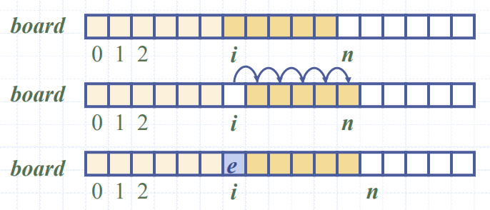
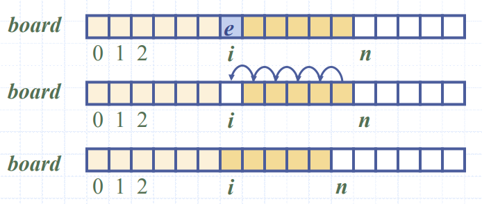

# Lecture 1 - Arrays

## Uses

You can use an array to store many similar values, for example video game top scores, or databases

## Definitions

- An *array* is a sequenced collection of variables all of the same type.
- Each variable or *cell* in an array has an *index*, which uniquely refers to the value stored in that cell.
- Each value stored in an array is often reffered to as an *element*.
- An array has a fixed length, which is often referred to as the *capacity*

## Implementation in Java

### Declaration

There are 2 ways to declare an array in Java:

1. Use an assignement to a literal form, declaring all the initial values:

   ```Java
   elementType[] arrayName = {intialValue(0),intitialValue(1),...,initialValue(n-1)}
   ```

   where `elementType` is any Java base type or class, with the intial values matching this.

2. Use the new operator:
   
   ```Java
   new elementType[length]
   ```

   This does not initialise any of the values. The `new` operator returns a reference to the new array which is usually assigned to an array variable.

Arrays can either store primitive elements, such as characters or integers, or it can store references to objects.

### Adding an Entry

To add an entry `e` at index `i` in an array, we need to make room by shifting ahead all the entries ahead (`n-i`) like so:



### Removing an Entry

Similarly, when removing an entry, we have to fill the hole left by shifting backwards the same elements (`n-i-1`)



## Insertion Sort

For insertion sort, we take the first element from the second part of the list (which is unsorted), and insert it in the correct part of the sorted section of the array at the front - shifting any higher values in the sorted section up in the process. We have to repeat this process `n-1` times for the entire list to be sorted. There is a great visualisation of this on [this website](https://visualgo.net/en/sorting).

### How good is the algorithm?

When sorting, at iteration `k` we put `A[k]` in its correct location. In order to do this, we have to compare `A[k]` with `A[k]`, `A[k]`, etc. until we reach `A[i]` where `A[i] < A[k]`. From this, we can see that the maximum number of camparisons is `k` in the worst-case scenario, where `A[k]` is the smallest element.

The worst case is `k` comparisons at iteration `k`.

To calculate the total number of iterations, we use the number of iterations in the worst case scenario - which we know is `i` iterations at position `i`. Therefore, the total is the summation of `i` up to `n-1`:

$$\sum_{i=1}^{n-1} = \frac{n(n-1)}{2} = \frac{1}{2}(n^2-n)$$

So we say that the complexity of the algorithm is $O(n^2)$.
