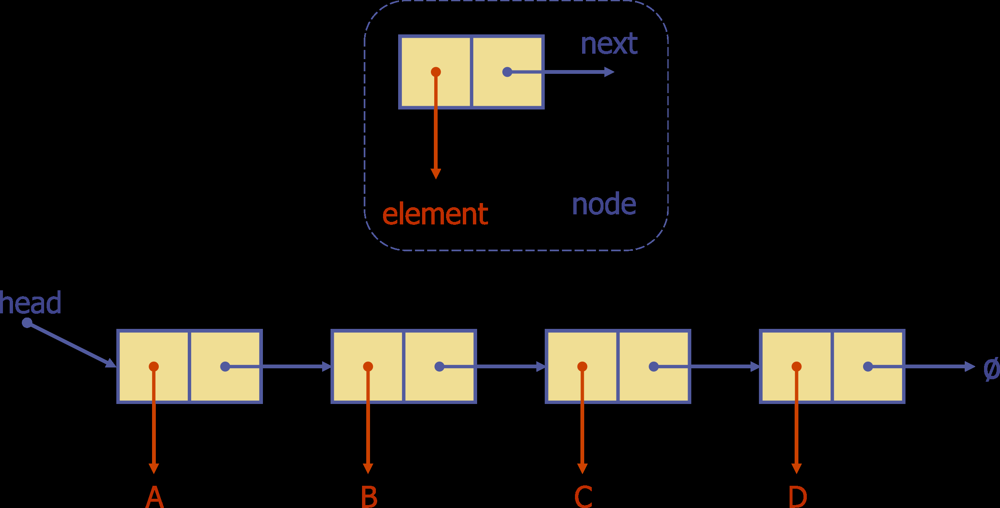
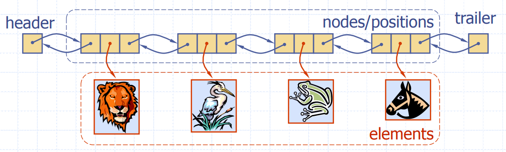

# Lecture 2 - Linked Lists

A linked list is a collection nodes which collectively form a linear sequence.

## Singly Linked Lists

A singly linked lists is a concrete data structure consisting of a sequence of nodes, starting from a head pointer, which points to the first element. Each node stores its own data (or a reference to an element), and a reference to the next node in the list.

### Inserting at the Head

1. Allocate a new node
2. Add the required element
3. Have new node point to old head node
4. Update head to point to the new node

### Inserting at the Tail

1. Allocate a new node
2. Add the required element
3. Have new node point to null
4. Update old tail to point to new tail node
5. Update tail to point to new node

### Removing the head

1. Update head to point to next node in list
2. Allow garbage collector to reclaim old head (or remove manually in other language)

### Removing the tail

Sadly there is no contant-time way to update the tail, as we have to traverse the entire linked list to reach it in order to remove.

## Doubly Linked Lists

A doubly linked list can be traversed forward and backward, as nodes store the element and a reference to both the previous and next node!

