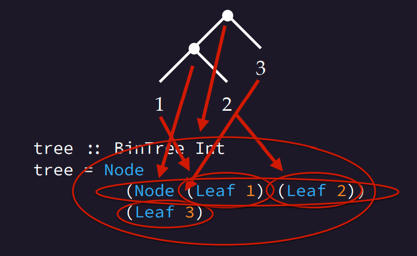

# Lecture 7 - Data types & type aliases

## Algebraic data types

### Booleans

Bool is a type with two values - `True`, and `False`.
The data type is defines as such:

```Haskell
data Bool = False | True
```

We can pattern-match on data constructors, and use them as values too:

```Haskell
not :: Bool -> Bool
not True = False
not False = True
```

We can have as many data constiurctors as we like:

```Haskell
data Module = CS141 | CS256 | CS263
data Language = PHP | JavaScript |CSharp | Haskell
data Unit = Unit
data Void
```

## Parametrised data constructors

```Haskell
data Shape = Rect Double Double
           | Circle Double
```

Rectangles have two `double` parameters and circles have just one.
This is visible in their types:

```Haskell
Rect   :: Double -> Double -> Shape
Circle :: Double -> Shape
```

These are used just like functions, and we can also use pattern matching

```Haskell
square :: Double -> Shape
square x = Rect x x

area :: Shape -> Double
area (Rect w h) = w * h
area (Circle r) = pi * r^2

isLine :: Shape -> Bool
isLine (Rect 1 h) = True
isLine (Rect w 1) = True
isLine _          = False
```

These are then evaluated as such:

```Haskell
   area (square 4.0)
=> area (Rect 4.0 4.0)
=> 4.0 * 4.0
=> 16.0

   area (Circle 5.0)
=> pi * 5.0^2
=> pi * 25.0
=> 78.53981633974483
```

## Parametrised data types

Type that says we either get no result or an integer:

```Haskell
data MaybeInt = Nothing | Just Int

safediv :: Int -> Int -> MaybeInt
safediv x 0 = Nothing
safediv x y = Just (div x y) 
```

This means we can divide by any number ensuring a safe result where dividing by 0.

This `MaybeInt` type could be useful for other types where we want a result in case of a fail. There is a solution - rather than having new type, we can parameterise data types of other types. The example could be rewritten as:

```Haskell
data Maybe a = Nothing | Just a

safediv :: Int -> Int -> Maybe Int
safediv x 0 = Nothing
safediv x y = Just (div x y)
```

the syntax of `div` looks quite wrong - however we can use any function as an infix operator by putting it in backticks. A bit of syntactic sugar which makes it more clear:

```Haskell
safediv x y = Just (x `div` y)
```

The `Maybe` type is also useful in other contexts - here is an example of creating a safer `head` function which will return `Nothing` from an empty list.

```Haskell
data Maybe a = Nothing | Just a

safehead :: [a] -> Maybe a
safehead []    = Nothing
safehead (x:_) = Just x
```

If we want to return the original data type rather than `Nothing` or `Just`, we could create a function which will return a default value in case `Nothing` is returned:

```Haskell
fromMaybe :: a -> Maybe a  -> a
-- if nothing, return default value x
fromMaybe x Nothing  = x
-- else return x
fromMaybe _ (Just x) = x
```

## Recursive data types

### Natural numbers

Each number is simply the successor to the previous, eventually landing on the base case of Zero

```Haskell
data Nat = Zero
         | Succ Nat

Zero :: Nat
Succ :: Nat -> Nat

--- For example:
one :: Nat
one = Succ Zero

two :: Nat
two = Succ one
--etc.
```

This is used in other functions as so

```Haskell
add :: Nat -> Nat -> Nat
add Zero     m = m
add (Succ n) m = Succ (add n m)

mul :: Nat -> Nat -> Nat
mul Zero     m = m
mul (Succ n) m = add m (mul n m)
```

for example adding 1+1 would be evaluated as:

```Haskell
   add (Succ Zero) (Succ Zero)
=> Succ (add Zero (Succ Zero))
=> Succ (Succ Zero)
```

### Binary Trees

```Haskell
data BinTree = Leaf Int
             | Node BinTree BinTree

Leaf :: a -> BinTree a
Node :: BinTree a -> BinTree a -> BinTree a
```

This can be represented fairly cleanly as:

```Haskell
tree :: BinTree Int
tree = Node (Node (Leaf 1) (Leaf 2)) (Leaf 3)
```



We can implement a `flatten` function to collapse a tree into a list:

```Haskell
flatten :: BinTree a -> [a]
flatten (Leaf x)   = [x]
flatten (Node l r) = flatten l ++ flatten r

--which evaluates like so:

   flatten (Node (Leaf 1) (Leaf 2))
=> flatten (Leaf 1) ++ flatten (Leaf 2)
=> [1] ++ flatten (Leaf 2)
=> [1] ++ [2]
=> [1,2]
```

similarly, we can calculate the depth of a tree:

```Haskell
depth :: BinTree a -> Int
depth (Leaf _)   = 1
depth (Node l r) = 1 + max (depth l) (depth r)
```

## Derivable type classes

Writing type class instances can be tedious:

```Haskell
data Bool = False | True
instance Eq Bool where
  True  == True  = True
  False == False = True
  _ = _ == False = False
```

Fortunately, the Haskell compiler can generate these automatically:

```Haskell
data Bool = False | True
  deriving Eq
```

## Type Aliases

Type aliases allow you to give a different name to a data type. For example, `String` is just a list of `Char`s

```Haskell
type String = [Char]
```

another commonly used type alias is `Predicate`:

```Haskell
type Predicate a = a -> Bool

isEven :: Predicate Int (turns into Int -> Bool)
isEven n = n `mod` 2 = 0

isEven' :: (Eq a, Integral a) => Predicate a (turns into a -> Bool)
isEven' n = n `mod` 2 = 0
```
