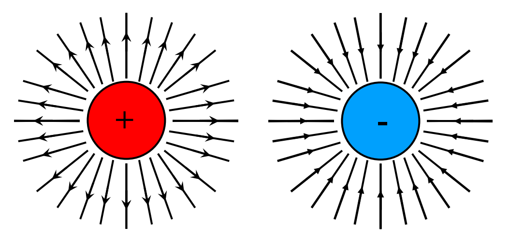

# Lecture 1: Fundamentals

## Charge

Electrons have a -ve charge, protons have an equal +ve charge. Charged particles create a field around them; this field attrcts opposite charged particles and repels like-charged particles.
As this field has the capacity to psuh and pull, it *has the capacity to do work*, therefore has energy.

- Charge is given the symbol $Q$
- The charge on a single electron is $-1.6 \times 10^{-19} C$
- The unit of charge is the Coulomb ($C$)
- Movement of charge, for example through a wire, gives an electric
current, $I$
- So current is the flow of charge per second, or $I=\frac{Q}{t}$
- So 1A is 1 Coulomb of charge transferred in 1s

### Bohr's Atomic Model

Electrons orbit a nucleus on different orbitals. These orbitals have fixed distances and fixed energies. The orbitals closest to the nucleus have the lowest energy, and the orbitals furthest away from the nucleus have the greatest energy (like a spring).

Usually, atoms have the same number of protons and electrons, which makes the overall charge neutral.

### Fields

The nearer you get to the charge, the stronger the field. As you move further from te charge, the field strength gets weaker, and the lines become more spread out.

The field lines radiate outwards becuase the field vector points in the direction of the force on a positive test charge - as like-charges repel, the positive charge repels the test charge. Similarly, on the negative charge, the lines go inwards, as a negative charge *pulls* a positive charge towards it.

#### Equal but opposite field charges

Since the net force on a charge can only be in one direction, field lines never intersect.

#### Two Identical Charges

### Force betweek two charged particles

The force that two point charges, $Q$ and $q$, separated by a distance $r$, exert on one another is given by:

$$F=\frac{KQq}{r^2} \text{ where } K=9\times10^9Nm^2/C^2$$

This force represents the ability to perform work – showing that there is *energy* in an electric field.

## Capacitors

A common way to produce a uniform electic field is with a parallel plate capaciitor which is made of two flat parallel plates, one negative, one positive. Capacitors are usually made of two metal plates seperated by a vacuum or dielectric insulator.

When a capacitor is connected across avoltage source, charge flows between the source and the capacitor’s plates until the voltage across the capacitor is equal to the source voltage.

Capacitance ($C$) is the measue of the capacitor's ability to store a charge, with the unit of a Farad ($F$). To calculate the capacitance we use the equation

$$C=\frac{εA}{d}$$

where $ε$ is the permittivity - the ability of a material to polarize and store a charge, $A$ is the area of the plates, and $d$ is the distance between them.

### Charging capacitors

The plates begin with and equal number of electrons and protons. When charging, electrons are transferred from one plate to another, causing one to have a shortage of electrons and the other to have an excess.

Once the power source is removed, the capacitor acts as a battery for a short period of time.

- Capacitance is the ratio of charge to voltage: $C=\frac{Q}{V}$
- which can be rearranged to get the charge on a capacitor $Q=CV$

### Dielectrics

Rather than using air or a vacuum between the plates, some materials can be polarised and used there instead to store the energy of the electric field much better and efficiently.

The permittivity is the material property that affects this force between two point charges. This changes with frequency, and higher permittivity reduces electric fields.

Absolute permittivity $ε_0$ is the permittivity of a vacuum ($≈8.854\times10^{-12} F/m$). Usually we talk aboutrelative permittivity, $\varepsilon_\mathrm{r}$ is the factor by which the electric field between the charges is decreased relative to vacuum. (sometimes called the dielectric constant, $κ$)

$$\varepsilon_\mathrm{r}=\frac{\varepsilon}{\varepsilon_0}$$

If we charge a capacitor, then insert a dielectric or increase the distance between plates, the charge will polarise the material, leading to a reduced voltage between the plates. As there is no change in actual charge, decreasing $V$ leads to increase in $C$.

#### Polarisation

- Polarisation is the process of dipole alignment
- This occurs in an electric field $E$
- The surface charge density $D$ is proportional to the electric field
- Dielectric added -> polarisation term $P$ is included to represent the addition polarisation caused by the dielectric
  - $D = \varepsilon_0E + P$ where $P = \varepsilon_0 (\varepsilon_\mathrm{r} - 1)E$

### Types of Capacitors

#### Mica Capacitors

Layers of foil with mica in between acting as the dielectric. Small and with high working voltage.

#### Ceramic Disk

Small nonpolarised. Have a relatively high capacitance due to high $\varepsilon_\mathrm{r}$.

#### Plastic Film

Similar to mica, just different construction - relatively high capacitance due to larger plate area (cylindrical tuble/roll)

#### Electrolytic

Very high capacitance but not as precise, high leakage current. Usually polarised.

#### Variable

Small screw thing that moves plates closer and further to adjust capacitance manually.
