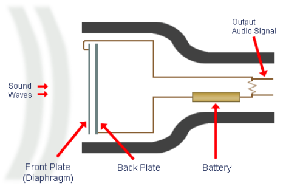

# Lecture 2 - Capacitors

## Adding capacitance

### In series

When capacitors are connected in series, the total capacitance is smaller than the smallest single capacitance. The general equation is

$$C_T=\frac{1}{\frac{1}{C_1}+\frac{1}{C_2}+\frac{1}{C_3}+...+\frac{1}{C_T}}$$

This can be derived as such

### In parallel

The total capacitance is the sum of the capacitance of each series capacitor:

$$C_T=C_1+C_2+C_3+...+C_n$$

## Capacitors in DC Circuits

Charging current begins high, but goes down very quickly. The opposite happens to voltage - begins low, goes up quickly but slows down.
When discarching, it is very similar - current starts high but drops very quickly, as does the voltage.

These follow an exponential curve.

$$v=V_F+(V_i-V_F)e^{-t/RC}$$
where  
$V_F =$ final value of voltage\
$V_i =$ initial value of voltage\
$v =$ instataneous value of voltage\

### Current-Voltage Relationship

From the formula for charge in a capacitor ($q = Cv$), we get the current-voltage relationship. Taking a derivative with respect to time gives

$$i = C \frac{dv}{dt}$$

Integrating this we get the voltage-currect equation for a capacitor

$$v(t)=\frac{1}{C}\int_{t_0}^{t}i(\tau)d\tau+v(t_0)$$

## Reactance

The ratio of votage to current -  a measure of how the component oppsoes the flow of electricity
In a resistor it's called *resistance*, but in inductors and capacitors it is called *reactance*, which is given the symbol $X$.

$$\begin{aligned}
\text{Reactance of an inductor, } X_L & = \omega L \\
\text{Reactance of a capacitor, } X_C & = \frac{1}{\omega C} \end{aligned}$$

Despite the different name, reactance still uses the units of ohms. Similarly, it is used in the same way as resistance in equations ($V=IX$).

The equation for capacitive reactance (the opposition to ac by a capacitor) is:
$$X_C=\frac{1}{2\pi fC}$$

## Capacitive phase shift

When a sine wave is applied to a capacitor, there is a *phase shift* between voltage and current such that current always leads the voltage by 90°.

### Phasor diagrams

Sinusoidal signals are characterised by their magnitude, frequence, and phase.
To understand the difference in phase we use phasor diagrams (essentially like force vector diagrams but for magnitude and phase of signals).

Like force diagrams, phasor diagrams can be used to represent addition and subtraction of signals

For example, we can apply *phasor analysis* to a series resistor-capacitor circuit. In this example, we start with voltagr through the resistor, which we know from the current, and add on the voltage through the capacitor at a right angle (phase difference 90°), to calculate the fianl voltage.

The same principle can be applied to a more complicated resistor-capacitor-inductor circuit.

In parallel circuits we analyse the current flows instead of voltage, in a similar way.

## Impedance

- In circuits containing only resisitve elements, the current is related to applied voltage by the resistance of the arrangement.
- In circuits containing *reactive* as well as *resistive* elements, the current is related to applied volatge by *impedance*, $Z$ of the arrangement.
  - This reflects not just magnitude of current, but also phase
  - impedance can be used in reactive circuits in a similar way to resistance in resistive circuits.

## Energy dissipated

- Energy is stored by the capacitor during a portion of the ac cycle and returned to the source during another portion of the cycle. An ideal capacitor does not lose energy (to heat).
- Voltage and current are always 90° out of phase. For this reason, no true power is dissipated by a capacitor, because stored energy is returned to the circuit.
- The rate at which a capacitor stores or returns energy is called *reactive power*. The unit for reactive power is the VAR (volt-ampere reactive).

## Usage examples

### Electrostatic loudspeakers

Use forces between electrically charged components (giving an electric field) to move a thin membrane. Usually a transformer is used to create the >3kV needed to drive.
The ac signal is applied to the 'grids' in the diagram, pushing and pulling the membrane to the grids, generating a sound.

### Condenser Microphones

Voltage is applied between diaphram and back plate. As disphram vibrates, distance between changes, as does capacitance.

### Piezoelectrics

In piezoelectric materials polarisation is induced when force is applied reversibly.This effect can be reversed as well. The effect is used in transducers eg ultarsonics (ultrasonic pulse creates a volatge), microphones, gas lighters (where pressing a piezoeletric generates a few kV voltage to spark).
