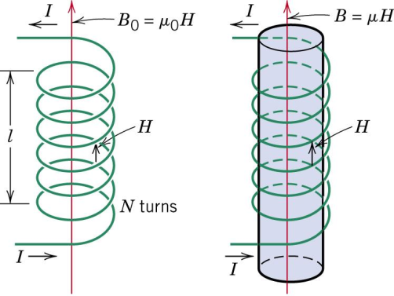

# Lecture 3 - Magnetic Fields

## Magnetic lines of force

Magnetic field lines do not stop, they are continuous. There is no magnetic equivalent to a point change (like electrons).

Magnetic lines of force are closed paths radiating from north to south pole, outside the magnet, and south to north inside the body. The lines never intersect each other.

## Fields

A magnetic field my by indiuced by flow of eletric current (moving electric charges) and by magnetic materials. The field at any given point is specified by a direction and a magnitude.

### Flux

The magnetic field lines are 'flow in a magnetic circuit. This is called *magnetic flux* ($\phi$, unit: Weber).
The field also has a magnetic flux density ($B$, unit: Weber $m^{-2}$, or Tesla).

$$\phi = B \perp A = BAcos\theta$$

As one Tesla is a very strong field, a commonly used smaller unt is the Guass. $1 T = 104 G$.

### Magnetic Materials

We know the magnetic flux here is calculated by
$$H=\frac{NI}{l}$$
in this diagram (where $H$ is the field):

However, this changes when a magnetic material is inserted. In particular, the material is magnetised, following the *magnetisation curve* (also known as a *hysteresis loop*):

Of note is the fact that when the field $H$ is removed, the field $B$ still exists - the material is magnetised (retentivity). A negative field has to be applied to annul this - at that point there is a field $H$ being applied, but field $B$ doesn't exist.

This loop changes depending on the material

- $B$ is the *magnetic flux density* in a body.
  - It is created as the response of a material to the external magnetic field, $H$
  - Called *magnetic induction* in some textbooks
- $H$ is the *magnetic field strength*, or the *external magnetic field*
- Ratio of $B/H$ is $μ$, the *permeability
- $μ$ is a measure of the degree to which a material can be magnetised
- Permeability of free space is $μ_0$
- Relative permeability ($μ/μ_0$) is $μ_r$

### Magnetisation

- Magnetisation ($M$) is another property which tells us to what degree a material can be magnetised. It is proportional to the applied magnetic field $H$.
- The susceptibility $\chi_m$ of a material is the constant of proportionality between $M$ and $H$ (unitless).
  
$$B=\mu_0H+\mu_0M$$
where $\mu_0H$ is the magnetic flux if no material was present, and $\mu_0M$ is the magnetic flux due to the material.

$$\begin{aligned}
M & = \chi_mH \\
\chi_m & = \mu_r-1 
\end{aligned}$$
