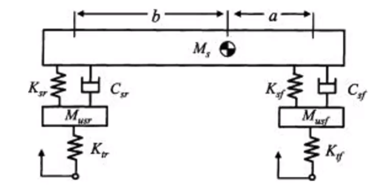

# Lecture 1 - Translational Mechanical Systems

Car suspensions are traslational systems. When going over bumps they start to oscilate but are stoped by dampers (shock absorbers). We can illustrate a system like this in a diagram:

## Key variables

Two basic variables are used to describe the dynamic
behaviour of translational mechanical systems:

| Variable               | Unit                      |
| ---------------------- | ------------------------- |
| - Force, $f(t)$        | Newtons ($N$)             |
| - Displacement, $x(t)$ | metres ($m$)              |
| - Velocity, $v(t)$     | metres/second ($ms^{-1}$) |

Displacement can be differentiated to get velocity and acceleration:

| Differentals                         | Meaning      |
| ------------------------------------ | ------------ |
| $x$                                  | displacement |
| $\dot{x}=v=\frac{dx}{dt}$            | velocity     |
| $\ddot{x}=\dot{v}=\frac{d^2x}{dt^2}$ | acceleration |

## Key Elements

- Mass
  - stores kinetic energy and potential energy
  - reversible
- Spring
  - stores potential energy (stretching/compression)
  - reversible
- Damper
  - dissipates energy as heat
  - non reversible
  - critical for stability (takes energy out of system)
  
## Element Equations

### Mass

$$m\frac{d}{dt}v(t) = f(t)$$
m (units $kg$)

#### Kinetic energy stored

$$W_k(t) = \frac{1}{2}mv^2(t)$$

### Spring

$$f(t)=k(x_1(t)-x_2(t))$$
k (units $Nm^{-1}$)

#### Energy stored

$$W_p(t)=k[(x_1(t) -x_2(t))^2]/2$$
